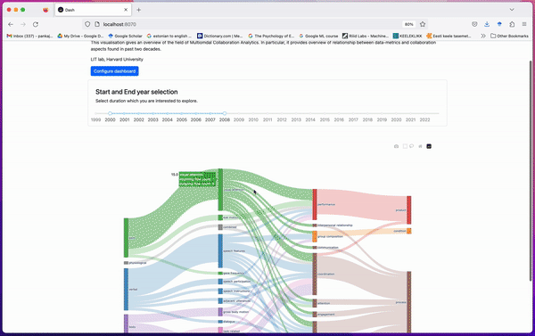

# Multimodal Collaboration Analytics (MMCA) Literature Review 
This repository contains source code for analyzing literature review dataset of MMCA.





## Setting up environment
First, you need to install required python packages and for that we recommend you set-up a virtual envrioment. 
You can use `requirement.txt` file which contains python packages list. You can use that file to setup your envrionment

## How to access formatted paper records using mmca library

This tutorial is targetted at providing information on accessing mmca literature review data in a formatted version.

* step-1: first import LiteratureDataset from mmcalib
* step-2: create an object of LiteratureDataset class by specify file_paths of data_metric, paper details, and paper meta CSV files.


```python
# import required classes
from mmcalib_cscw import LiteratureDataset


lit = LiteratureDataset('5.2023 CSCW dataset_data_metrics.csv',
                       '5.2023-CSCW-paper_details.csv',
                       '5.2023-CSCW-dataset-paper_meta.csv')

```

    Populating with paper records ...
    'float' object has no attribute 'replace'
    Excluding paper: 76
    Literature dataset is succefully populated. 
      Total papers: 144
    Updated paper records with study setting, learning task, sample size and experimental study type


### Accessing paper record
Once you have created Literature Dataset object and populated it with papers record, you can access paper records.


```python
# fetching a paper with a particular id
paper = lit.get_paper(10)

# printing paper details
paper.print_paper_record()
```

    
    ####################   PAPER ID: 10     ####################
    
    Year: 2018.0
    Title: A Network Analytic Approach to Gaze Coordination during a Collaborative Task
    Study setting: lab
    Learning task: Each dyad was assigned a sandwich-building task: one participant made verbal references to visible ingredients they would like added to their sandwich, while the other participant assembled those ingredients into a sandwich.
    Study setting: G=13; I=26
    Data: {'i': 'eye gaze'}
    Metrics: {'1': 'gaze fixations', '2': 'gaze saccades'}
    Metrics smaller: {'1': 'visual attention', '2': 'eye motion'}
    Metrics larger: {'1': 'gaze', '2': 'gaze'}
    Outcomes: {'a': 'task performance'}
    Outcomes smaller: {'a': 'performance'}
    Outcomes larger: {'a': 'product'}
    Outcomes instrument: {'a': 'human evaluation'}
    Experimental type: NS
    Results: 1+2-A: correlation: nonsig
    Results: [('visual attention', 'performance', ' correlation', 'nonsig'), ('eye motion', 'performance', ' correlation', 'nonsig')]
    
    ############################################################
    


### Accessing particular details of the paper
You can access information like data, metrics, outcomes, relationship in a structured way once you have paper obejct.


```python
import pprint as pp
```


```python
# accessing metrics

# original metrics reported in the paper
metrics_org = paper.get_metrics_org()

# smaller metrics codes
metrics_sm = paper.get_metrics_sm()

# larger metrics codes
metrics_lg = paper.get_metrics_lg()
```


```python
pp.pprint(metrics_org)
```

    {'1': 'gaze fixations', '2': 'gaze saccades'}


In a similar way you can access the outcomes investigated in the paper.


```python
outcomes_sm = paper.get_outcomes_sm()
outcomes_lg = paper.get_outcomes_lg()
```


```python
pp.pprint(outcomes_sm)
```

    {'a': 'performance'}


### Accessing relationship data
Each paper object has relationship mapping in the form of a dictionary.


```python
# accessing raw relationship codes
raw_relationship = paper.get_raw_relationship()
print('Raw relationship:',raw_relationship)

relationship = paper.parse_relationship()
print('Processed relationshp:')
pp.pprint(relationship)
```

    Raw relationship: 1+2-A: correlation: nonsig
    Processed relationshp:
    [('visual attention', 'performance', ' correlation', 'nonsig'),
     ('eye motion', 'performance', ' correlation', 'nonsig')]


Parsed relationships are in tuple form. For example the first tuple ('visual attention', 'performance', ' correlation') represents that the paper has found a relationship between visual attention and performance using correlation analysis.

### Generating an interactive dashboard for exploration
Run following command to generate a dashboard.

```
> python3 dashboard_mmca_cscw.py
```

Next, open your browser and type `http://localhost:8070`


